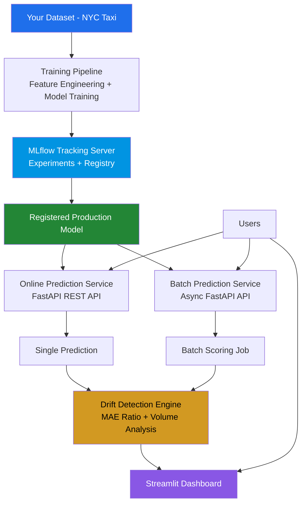
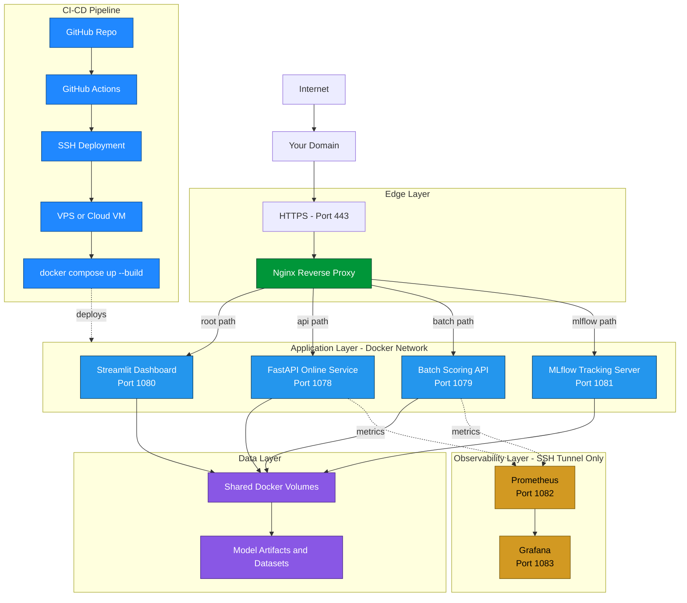

# MLOps-Platform

**Production-Ready MLOps Platform for Machine Learning Systems**


---

## 📚 Table of Contents

- [🎯 What Is MLOps-Platform?](#-what-is-mlops-platform)
- [✨ Key Features](#-key-features)
- [🏗️ System Architecture](#️-system-architecture)
- [📁 Project Structure](#-project-structure)
- [🚀 Quick Start](#-quick-start)
- [🔄 Adapting for Your Own Project](#-adapting-for-your-own-project)
- [📦 Environment Management with uv](#-environment-management-with-uv)
- [📊 Services & Ports](#-services--ports)
- [🛠️ Technology Stack](#️-technology-stack)
- [📈 Monitoring & Observability](#-monitoring--observability)
- [🌐 Deployment](#-deployment)
- [📚 Documentation](#-documentation)
- [🔧 Commands](#-commands)
- [📖 What You've Built](#-what-youve-built)
- [🤝 Contributing](#-contributing)
- [📄 License](#-license)

---

## 🎯 What Is MLOps-Platform?

**MLOps-Platform** is a complete, production-ready MLOps framework designed to solve most classical ML problems with minimal modification and migration.

This is a **reusable, extensible platform** built with the following principles:

- **Template-First** — Use as a foundation for any ML project
- **Minimal Migration** — Swap datasets and models with minimal changes
- **Streamlined Automation** — End-to-end automation from training to deployment
- **Production-Ready** — Includes monitoring, drift detection, and CI/CD out of the box

### Current Implementation: TaxiML

This repository implements the platform using the **NYC Taxi Trip Duration** prediction problem as the concrete use case — demonstrating how to apply the platform to a real-world ML problem.

**You can use this repository as:**
- A **template** for your own ML projects
- A **reference** for production MLOps patterns
- A **portfolio** piece showing end-to-end ML engineering
- A **foundation** to build your own MLOps platform

> 📸 *Add a screenshot or GIF of the Streamlit dashboard / Grafana panel here — nothing sells a project faster than seeing it running.*

---

## ✨ Key Features

| Feature | Description |
|---|---|
| **ML Pipeline** | Automated training with feature engineering and hyperparameter tuning |
| **Experiment Tracking** | MLflow for tracking runs, metrics, and model registry |
| **Real-time API** | FastAPI serving predictions with <100ms latency |
| **Batch Scoring** | Asynchronous batch processing with drift detection |
| **Drift Detection** | Evidently AI for monitoring data drift and model degradation |
| **Operational Monitoring** | Prometheus + Grafana for system health metrics |
| **Interactive Dashboard** | Streamlit for visualizing drift reports and performance |
| **CI/CD** | GitHub Actions for automated deployment |
| **SSL** | Let's Encrypt for HTTPS with auto-renewal |
| **Production Ready** | Docker, nginx, and VPS deployment |
| **Reusable Architecture** | Designed to be extensible for any ML problem |

---

## 🏗️ System Architecture

### Logical Architecture



### Infrastructure Architecture



---

## 📁 Project Structure

```
mlops-platform/
├── .github/                        # CI/CD
│   └── workflows/
│       └── deploy.yml              # GitHub Actions workflow
├── api/                            # Online prediction service
│   ├── main.py                     # FastAPI server
│   ├── metrics.py                  # Prometheus metrics
│   ├── model_loader.py             # MLflow model loading
│   ├── schema.py                   # Pydantic schemas
│   └── Dockerfile
├── batch/                          # Batch scoring service
│   ├── main.py                     # Batch API
│   ├── core.py                     # Scoring + drift detection
│   ├── flow.py                     # Prefect flow
│   ├── batch_results.db            # SQLite results
│   ├── drift_reports/              # Evidently reports
│   ├── predictions/                # Scored predictions
│   └── Dockerfile
├── dashboard/                      # Streamlit dashboard
│   ├── app.py                      # Main dashboard
│   ├── drift_tab.py                # Drift visualization
│   └── Dockerfile
├── pipeline/                       # Training pipeline
│   ├── main.py                     # Entry point
│   ├── flow.py                     # Prefect flow
│   ├── config/                     # Configuration
│   ├── src/
│   │   ├── data/                   # Data acquisition & preprocessing
│   │   ├── features/               # Feature engineering
│   │   ├── models/                 # Training & registry
│   │   └── utils/                  # Utilities
│   ├── mlruns/                     # MLflow artifacts
│   └── mlflow_trip_duration.db     # MLflow registry
├── monitoring/                     # Observability
│   ├── prometheus/
│   │   └── prometheus.yml
│   └── grafana/
│       ├── datasources/
│       └── dashboards/
├── notebooks/                      # Exploration notebooks
│   ├── 01_explore.ipynb            # Initial exploration
│   ├── 02_broken.ipynb             # Deliberately broken
│   └── 03_fixed.ipynb              # Production ready
├── shared/                         # Shared code
│   └── feature_engineering.py
├── docs/                           # Documentation
│   ├── API_REFERENCE.md            # API documentation
│   ├── DEPLOYMENT.md               # Deployment guide
│   ├── ARCHITECTURE.md             # Architecture deep dive
│   ├── PLATFORM_GUIDE.md           # How to adapt for new projects
│   └── ...
├── docker-compose.yml              # Local development
├── docker-compose.vps.yml          # VPS deployment
├── Makefile                        # Common tasks
├── pyproject.toml                  # Python dependencies
├── uv.lock                         # Locked dependencies
├── .env.example                    # Environment template
└── README.md                       # This file
```

---

## 🚀 Quick Start

### Prerequisites

- Python 3.12+
- Docker and Docker Compose
- Git
- [uv](https://docs.astral.sh/uv/) (fast Python package installer)

### Install uv

```bash
# macOS/Linux
curl -LsSf https://astral.sh/uv/install.sh | sh

# Windows
powershell -c "irm https://astral.sh/uv/install.ps1 | iex"

# Verify installation
uv --version
```

### Local Development

```bash
# 1. Clone the repository
git clone https://github.com/your-username/mlops-platform.git
cd mlops-platform

# 2. Create isolated virtual environment with uv
uv venv

# 3. Activate the virtual environment
source .venv/bin/activate  # Linux/macOS
# .venv\Scripts\activate   # Windows

# 4. Install dependencies
uv sync

# 5. Train the model (TaxiML example)
cd pipeline
python main.py --sample-size 500000 --tune --promote
cd ..

# 6. Start all services
docker compose up -d

# 7. Open the dashboard
open http://localhost:1080
```

### Test the System

```bash
# Check health
curl http://localhost:1078/health
curl http://localhost:1079/health

# Make a prediction
curl -X POST http://localhost:1078/predict \
  -H "Content-Type: application/json" \
  -d '{
    "tpep_pickup_datetime": "2020-04-15T14:30:00",
    "PULocationID": 161,
    "DOLocationID": 237,
    "passenger_count": 1,
    "trip_distance": 2.5,
    "VendorID": 1,
    "RatecodeID": 1,
    "payment_type": 1
  }'

# Run batch scoring
curl -X POST "http://localhost:1079/score?year=2024&month=6"

# View results
curl "http://localhost:1079/results"
```

---

## 🔄 Adapting for Your Own Project

### Minimal Changes Required

1. **Update Data Pipeline**
   - Modify `pipeline/src/data/data_acquisition.py` for your data source
   - Update `pipeline/src/features/feature_engineering.py` for your features

2. **Update Model**
   - Modify `pipeline/src/models/model_training.py` for your ML algorithm
   - Update hyperparameter tuning configuration

3. **Update API Schema**
   - Modify `api/schema.py` for your input/output format

4. **Update Environment**
   - Configure `pipeline/config/config.py` with your settings
   - Update `.env` with your variables

### What Stays the Same

| Component | Why It's Reusable |
|---|---|
| **MLflow Tracking** | Experiment tracking works for any ML problem |
| **FastAPI Serving** | API structure is generic |
| **Drift Detection** | Evidently works with any feature set |
| **Monitoring Stack** | Prometheus/Grafana are tool-agnostic |
| **CI/CD Pipeline** | Deployment process is identical |
| **Docker Setup** | Containerization is standard |

---

## 📦 Environment Management with uv

<details>
<summary><strong>What is uv?</strong></summary>

uv is an extremely fast Python package installer and resolver, built in Rust. It's a drop-in replacement for pip and pip-tools.

</details>

<details>
<summary><strong>Managing the Environment (click to expand)</strong></summary>

```bash
# Create a new virtual environment
uv venv

# Activate it
source .venv/bin/activate

# Install all dependencies
uv sync

# Add a new dependency
uv add requests

# Add a dev dependency
uv add --dev pytest

# Remove a dependency
uv remove requests

# Update all dependencies
uv sync --upgrade

# Run a script in the environment
uv run python pipeline/main.py

# Export requirements.txt (if needed)
uv export --format requirements-txt > requirements.txt
```

</details>

<details>
<summary><strong>pyproject.toml (click to expand)</strong></summary>

```toml
[project]
name = "mlops-platform"
version = "1.0.0"
description = "Production-Ready MLOps Platform for Machine Learning Systems"
readme = "README.md"
requires-python = ">=3.12"
dependencies = [
    # Data Processing
    "numpy>=1.24.0",
    "pandas>=2.0.0",
    "pyarrow>=14.0.0",
    "scikit-learn>=1.3.0",
    "xgboost>=2.0.0",

    # MLflow 3.x
    "mlflow>=3.0.0",

    # Prefect 3.x
    "prefect>=3.0.0",

    # API & Web
    "fastapi>=0.115.0",
    "uvicorn[standard]>=0.30.0",
    "pydantic>=2.5.0",

    # Monitoring
    "prometheus-client>=0.24.1",
    "evidently>=0.7.21",
    "aiohttp>=3.14.1",

    # Dashboard
    "streamlit>=1.38.0",
    "plotly>=5.22.0",

    # Utilities
    "python-dotenv>=1.0.0",
    "sqlalchemy>=2.0.0",
    "joblib>=1.3.0",
    "requests>=2.31.0",

    # Notebooks
    "jupyter>=1.1.1",
    "ipykernel>=7.1.0",
    "matplotlib>=3.7.0",
    "seaborn>=0.12.0",

    # Data Sources
    "kagglehub>=0.2.0",
]

[project.optional-dependencies]
dev = [
    "pytest>=7.4.0",
    "pytest-cov>=4.1.0",
    "black>=23.11.0",
    "ruff>=0.1.0",
    "mypy>=1.7.0",
    "pre-commit>=3.5.0",
]

[tool.uv]
dev-dependencies = [
    "pytest>=7.4.0",
    "pytest-cov>=4.1.0",
    "black>=23.11.0",
    "ruff>=0.1.0",
    "mypy>=1.7.0",
    "pre-commit>=3.5.0",
]

[tool.black]
line-length = 88
target-version = ["py312"]

[tool.ruff]
line-length = 88
target-version = "py312"

[tool.ruff.lint]
select = ["E", "F", "W", "I", "N", "D", "UP"]
ignore = ["D100", "D104", "D107"]

[tool.mypy]
python_version = "3.12"
ignore_missing_imports = true
```

</details>

---

## 📊 Services & Ports

| Service | Port | Description |
|---|---|---|
| **API** | 1078 | Real-time predictions via FastAPI |
| **Batch** | 1079 | Batch scoring + drift detection |
| **Dashboard** | 1080 | Streamlit UI |
| **MLflow** | 1081 | Experiment tracking |
| **Prometheus** | 9090 | Metrics collection |
| **Grafana** | 3000 | Visualization dashboards |

### Local URLs

```
http://localhost:1080  → Streamlit dashboard
http://localhost:1078/health  → Online API health
http://localhost:1079/health  → Batch API health
http://localhost:1081  → MLflow tracking UI
http://localhost:9090  → Prometheus metrics
http://localhost:3000  → Grafana dashboards
```

---

## 🛠️ Technology Stack

| Layer | Technologies |
|---|---|
| **ML** | scikit-learn, XGBoost, pandas, numpy |
| **Tracking** | MLflow |
| **Orchestration** | Prefect |
| **API** | FastAPI, uvicorn |
| **Drift Detection** | Evidently AI |
| **Monitoring** | Prometheus, Grafana |
| **Containerization** | Docker, Docker Compose |
| **CI/CD** | GitHub Actions |
| **SSL** | Certbot, Let's Encrypt |
| **Reverse Proxy** | Nginx |
| **Dashboard** | Streamlit |
| **Language** | Python 3.12+ |
| **Package Manager** | uv |
| **Testing** | pytest |

---

## 📈 Monitoring & Observability

### Three Layers of Monitoring

| Layer | Tool | What It Monitors |
|---|---|---|
| **Operational** | Prometheus + Grafana | API health: latency, errors, traffic, predictions |
| **Performance** | Batch + Evidently | Model quality: MAE, MAE ratio, volume |
| **Data Drift** | Evidently + Streamlit | Feature distributions: drift score, drift detection |

### Key Metrics

| Metric | 🟢 Healthy | 🟡 Warning | 🔴 Alert |
|---|---|---|---|
| API Latency (p95) | < 100ms | 100–500ms | > 500ms |
| Error Rate | < 0.1% | 0.1–1% | > 1% |
| MAE Ratio | < 1.2 | 1.2–1.5 | > 1.5 |
| Drift Score | < 0.3 | 0.3–0.5 | ≥ 0.5 |
| Prediction Volume | > 500k | 300–500k | < 300k |

### Dashboards

| Dashboard | What It Shows | When To Check |
|---|---|---|
| **Operational** | Request rate, latency, errors | Daily |
| **Business** | Prediction volume, distribution | Weekly |
| **Model Performance** | MAE, drift score | Monthly |

---

## 🌐 Deployment

### VPS Deployment

```bash
# Deploy to VPS
make deploy

# Or manually
ssh user@vps-ip
cd /path/to/mlops-platform
git pull origin main
docker compose -f docker-compose.vps.yml up -d --build
sudo nginx -t && sudo systemctl reload nginx
```

### Production URLs

```
https://your-domain.com/              → Dashboard
https://your-domain.com/api/health    → API Health
https://your-domain.com/api/predict   → Predictions
https://your-domain.com/batch/score   → Batch Scoring
https://your-domain.com/batch/results → Results
https://your-domain.com/mlflow/       → MLflow UI
```

### Monitoring Access (SSH Tunnel)

Since Prometheus and Grafana contain sensitive metrics, they're not exposed publicly:

```bash
# Tunnel to access monitoring
ssh -L 9090:localhost:1082 -L 3000:localhost:1083 user@vps-ip

# Then open in browser:
http://localhost:9090  → Prometheus
http://localhost:3000  → Grafana
```

<details>
<summary><strong>CI/CD Setup (click to expand)</strong></summary>

1. Add GitHub Secrets:
   - `PRIVATE_KEY` - VPS SSH private key
   - `HOST` - VPS IP address
   - `USERNAME` - VPS username
   - `PROJECT_PATH` - Full path to project on VPS

2. Push to main:
   ```bash
   git push origin main
   # GitHub Actions automatically deploys
   ```

</details>

<details>
<summary><strong>Firewall Configuration (click to expand)</strong></summary>

```bash
# On VPS
sudo ufw allow 22/tcp
sudo ufw allow 80/tcp
sudo ufw allow 443/tcp
sudo ufw allow 1082/tcp  # Prometheus (optional, for SSH tunnel)
sudo ufw allow 1083/tcp  # Grafana (optional, for SSH tunnel)
sudo ufw enable
```

</details>

---

## 📚 Documentation

### Core Documentation

| Document | Description |
|---|---|
| [API_REFERENCE.md](docs/API_REFERENCE.md) | Complete API documentation |
| [DEPLOYMENT.md](docs/DEPLOYMENT.md) | VPS deployment guide |
| [ARCHITECTURE.md](docs/ARCHITECTURE.md) | System architecture deep dive |
| [PLATFORM_GUIDE.md](docs/PLATFORM_GUIDE.md) | How to adapt for your own projects |

<details>
<summary><strong>Concept Documentation (click to expand)</strong></summary>

| Document | Concept |
|---|---|
| [MONITORING_CONCEPTS.md](docs/MONITORING_CONCEPTS.md) | Mental model for monitoring |
| [PROMETHEUS_GRAFANA.md](docs/PROMETHEUS_GRAFANA.md) | Prometheus + Grafana setup |
| [EVIDENTLY_DRIFT.md](docs/EVIDENTLY_DRIFT.md) | Drift detection with Evidently |
| [METRICS_REFERENCE.md](docs/METRICS_REFERENCE.md) | All metrics and alert thresholds |
| [MLFLOW_QUICKSTART.md](docs/MLFLOW_QUICKSTART.md) | Experiment tracking |
| [PREFECT_QUICKSTART.md](docs/PREFECT_QUICKSTART.md) | Orchestration |
| [FASTAPI.md](docs/FASTAPI.md) | Online serving |
| [DOCKER_FOR_ML.md](docs/DOCKER_FOR_ML.md) | Containerization |
| [MLFLOW_REGISTRY.md](docs/MLFLOW_REGISTRY.md) | Model registry |
| [BATCH_DEPLOYMENT.md](docs/BATCH_DEPLOYMENT.md) | Batch scoring |
| [SYSTEM_INTEGRATION.md](docs/SYSTEM_INTEGRATION.md) | Docker networking |
| [MLFLOW_SERVER.md](docs/MLFLOW_SERVER.md) | Tracking server |
| [MLOPS_LIFECYCLE.md](docs/MLOPS_LIFECYCLE.md) | Complete lifecycle |
| [ngnix.md](docs/ngnix.md) | Reverse proxy |
| [SSL.md](docs/SSL.md) | HTTPS setup |
| [CICD.md](docs/CICD.md) | CI/CD pipeline |

</details>

---

## 🔧 Commands

<details>
<summary><strong>Environment Setup</strong></summary>

```bash
uv venv                              # Create virtual environment
source .venv/bin/activate            # Activate virtual environment
uv sync                              # Install all dependencies
uv add <package>                     # Add a new dependency
uv add --dev <package>               # Add a dev dependency
uv remove <package>                  # Remove a dependency
uv sync --upgrade                    # Update all dependencies
```

</details>

<details>
<summary><strong>Training</strong></summary>

```bash
python pipeline/main.py --help       # Show training options
python pipeline/main.py --sample-size 500000 --tune --promote
python pipeline/main.py --sample-size 1000000 --tune --promote
```

</details>

<details>
<summary><strong>Services</strong></summary>

```bash
docker compose up -d                 # Start all services
docker compose down                  # Stop all services
docker compose logs -f               # View logs
docker compose ps                    # Check service status
docker compose restart <service>     # Restart a specific service
```

</details>

<details>
<summary><strong>Testing & Batch Scoring</strong></summary>

```bash
# Testing
curl http://localhost:1078/health    # API health
curl http://localhost:1079/health    # Batch health
curl http://localhost:1080/health    # Dashboard health

# Batch Scoring
curl -X POST "http://localhost:1079/score?year=2024&month=6"
curl -X POST "http://localhost:1079/score-range?start=2020-01&end=2024-06"
curl "http://localhost:1079/results"
curl "http://localhost:1079/drift/summary"
```

</details>

<details>
<summary><strong>Monitoring & Cleanup</strong></summary>

```bash
# Monitoring
curl http://localhost:9090/api/v1/targets    # Prometheus targets
curl http://localhost:3000/api/health        # Grafana health

# Cleanup
docker compose down -v               # Remove containers and volumes
rm -rf pipeline/mlruns/              # Remove MLflow artifacts
rm -rf pipeline/*.db                 # Remove databases
rm -rf batch/drift_reports/          # Remove drift reports
rm -rf batch/predictions/            # Remove predictions
rm -rf .venv/                        # Remove virtual environment
```

</details>

---

## 📖 What You've Built

✅ Production-ready MLOps platform

✅ Real-time API with FastAPI

✅ Batch scoring with drift detection

✅ Experiment tracking with MLflow

✅ Orchestration with Prefect

✅ Monitoring with Prometheus + Grafana

✅ CI/CD with GitHub Actions

✅ SSL with Let's Encrypt

✅ Interactive dashboard with Streamlit

✅ Complete documentation

✅ Deployable to any cloud or VPS

✅ Fully containerized with Docker

✅ Isolated environment with uv

✅ Locked dependencies with uv.lock

✅ Production-grade code quality

✅ Reusable architecture for any ML problem

✅ Minimal migration path for new projects

---

## 📊 Platform vs Use Case

| Aspect | Platform | Use Case (TaxiML) |
|---|---|---|
| **Purpose** | Reusable MLOps framework | Concrete ML problem |
| **Scope** | Any ML problem | NYC taxi prediction |
| **Data** | Generic data pipeline | Taxi trip data |
| **Model** | Training framework | XGBoost model |
| **Features** | Feature engineering framework | Taxi-specific features |
| **Value** | Accelerate new projects | Demonstrate platform |

---

## 🤝 Contributing

Contributions are welcome! Please open an issue or submit a pull request.

### Development Setup

```bash
# Clone the repository
git clone https://github.com/your-username/mlops-platform.git
cd mlops-platform

# Setup development environment
uv venv
source .venv/bin/activate
uv sync --dev

# Run tests
pytest tests/

# Run linting
ruff check .

# Format code
black .
```

---

## 📄 License

This project is open source and available under the MIT License.

---

## 🙏 Acknowledgments

- NYC Taxi & Limousine Commission for the open dataset
- Open source community for the amazing tools
- Contributors and users of this platform

---

**Built with ❤️ for the MLOps community**

---

## Quick Reference Card

<details>
<summary><strong>URLs, Key Files & Make Commands (click to expand)</strong></summary>

### URLs (Local)
```
Dashboard:  http://localhost:1080
API Docs:   http://localhost:1078/docs
Batch Docs: http://localhost:1079/docs
MLflow:     http://localhost:1081
Prometheus: http://localhost:9090
Grafana:    http://localhost:3000
```

### URLs (Production)
```
Dashboard:  https://your-domain.com/
API:        https://your-domain.com/api/
Batch:      https://your-domain.com/batch/
MLflow:     https://your-domain.com/mlflow/
```

### Key Files
```
pipeline/main.py          → Train the model
api/main.py               → FastAPI server
batch/main.py              → Batch API
dashboard/app.py           → Streamlit dashboard
docker-compose.yml         → Local services
pyproject.toml             → Dependencies
uv.lock                    → Locked dependencies
Makefile                   → Common tasks
docs/PLATFORM_GUIDE.md     → How to adapt
```

### uv Quick Reference
```bash
uv venv                  # Create virtual environment
source .venv/bin/activate # Activate it
uv sync                  # Install dependencies
uv add <package>         # Add dependency
uv add --dev <package>   # Add dev dependency
uv remove <package>      # Remove dependency
uv sync --upgrade        # Update dependencies
uv run python script.py  # Run script in environment
```

### Make Commands
```bash
make install   # Install dependencies
make train     # Train the model
make start     # Start all services
make stop      # Stop all services
make deploy    # Deploy to VPS
make status    # Check service status
make logs      # View logs
make clean     # Clean artifacts
```

</details>